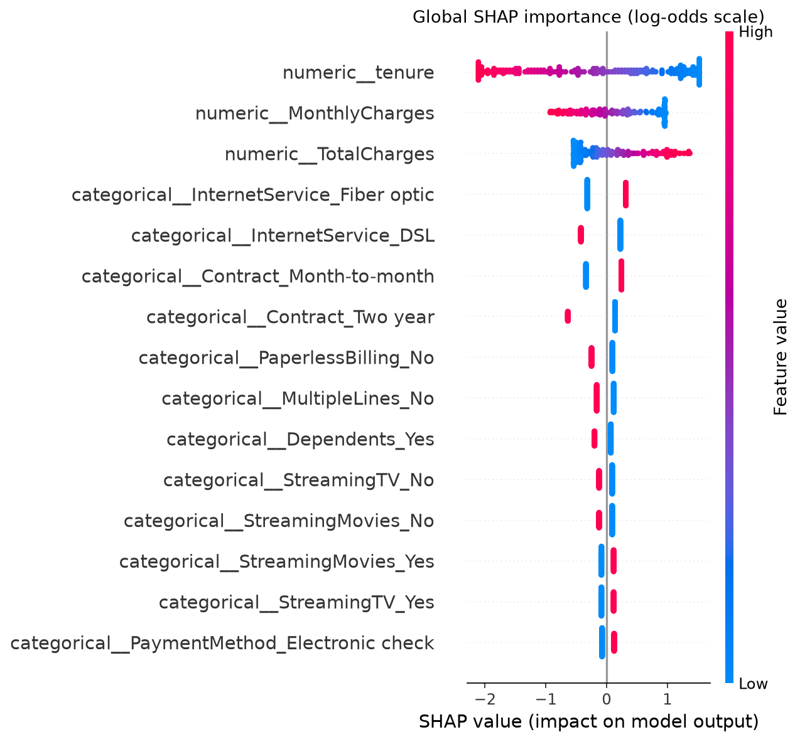

# Customer Churn Prediction

An end-to-end machine learning project that predicts customer churn using the IBM Telco Customer Churn dataset. This project covers data cleaning, exploratory data analysis, leakage-safe preprocessing, model comparison, hyperparameter tuning, threshold optimization, SHAP explainability, automated testing, and a reusable prediction interface.

## Problem Statement

Customer churn occurs when customers stop using a company's services. Identifying customers at higher risk of leaving can help businesses prioritize retention efforts.

This project develops a classification pipeline to estimate churn risk and evaluates how different prediction thresholds affect the trade-off between missed churners and unnecessary retention interventions.

## Key Results

The final Logistic Regression model was evaluated on a held-out test set.

| Metric                      | Test result |
| --------------------------- | ----------: |
| ROC-AUC                     |      0.8421 |
| PR-AUC (Average Precision)  |      0.6343 |
| Accuracy                    |      80.55% |
| Precision at threshold 0.50 |      65.72% |
| Recall at threshold 0.50    |      55.88% |
| F1-score at threshold 0.50  |      0.6040 |

### Threshold and Business-Cost Analysis

A lower classification threshold identifies more potential churners but also flags more customers who would not churn.

| Metric                  | Threshold 0.50 | Threshold 0.15 |
| ----------------------- | -------------: | -------------: |
| Precision               |         65.72% |         43.96% |
| Recall                  |         55.88% |         91.44% |
| False negatives         |            165 |             32 |
| False positives         |            109 |            436 |
| Illustrative cost score |            934 |            596 |

The illustrative cost assigns a cost of 5 to each false negative and 1 to each false positive. Under this assumption, the 0.15 threshold reduces the cost score by approximately 36.2%.

These are assumed relative costs, not measured financial savings. The 0.15 threshold was selected using cross-validation on training data before evaluation on the held-out test set.

## Approach

1. **Data cleaning:** Validate customer identifiers, handle missing values, remove exact duplicates, and encode the target.
2. **Exploratory data analysis:** Examine churn distribution and relationships with contract type, tenure, monthly charges, and other customer attributes.
3. **Leakage-safe preprocessing:** Impute missing values, scale numeric features where appropriate, and one-hot encode categorical features. Exclude customer IDs from model inputs.
4. **Data splitting:** Use a stratified train/test split with a fixed random seed.
5. **Baseline modeling:** Establish a Logistic Regression baseline using stratified cross-validation.
6. **Model comparison:** Compare a Dummy baseline, Logistic Regression, Decision Tree, Random Forest, Extra Trees, and K-Nearest Neighbors.
7. **Class imbalance experiments:** Investigate class weighting to improve churn recall.
8. **Hyperparameter tuning:** Use cross-validation and average precision to select model parameters.
9. **Threshold analysis:** Compare thresholds using an explicit cost assumption.
10. **Explainability:** Use SHAP to inspect global feature importance and individual predictions.
11. **Quality checks:** Run automated tests and Ruff linting locally and through GitHub Actions.

## Explainability

SHAP analysis highlights features that influence predictions across the evaluated sample.



The leading features in the current analysis include tenure, total charges, internet service type, monthly charges, and contract type.

Feature importance describes model behavior; it does not establish causation.

## Technology Stack

- **Language:** Python
- **Data processing:** Pandas, NumPy
- **Machine learning:** scikit-learn
- **Explainability:** SHAP
- **Visualization:** Matplotlib, Seaborn
- **Testing and code quality:** pytest, Ruff
- **Automation:** Make, GitHub Actions

## Repository Structure

```text
customer-churn-prediction/
├── .github/workflows/   # Continuous integration
├── data/
│   ├── raw/             # Original dataset (not committed)
│   └── processed/       # Cleaned data and splits (not committed)
├── models/              # Generated model artifacts
├── notebooks/           # Exploratory data analysis
├── reports/             # Evaluation summaries and SHAP visualization
├── scripts/             # Cleaning, training, evaluation, and analysis
├── src/                 # Reusable data and preprocessing modules
├── tests/                # Automated tests
├── Makefile
└── requirements.txt
```

## Setup

Create and activate a Python virtual environment, then install the dependencies:

```bash
python -m venv .venv
source .venv/bin/activate
python -m pip install --upgrade pip
make setup
```

Place the IBM Telco Customer Churn CSV at:

`data/raw/telco_churn.csv`

Dataset source: [IBM Telco Customer Churn dataset](https://raw.githubusercontent.com/IBM/telco-customer-churn-on-icp4d/master/data/Telco-Customer-Churn.csv).

## Run the Pipeline

Run these commands from the repository root, in order:

```bash
python scripts/clean_data.py \
  --input data/raw/telco_churn.csv \
  --output data/processed/telco_churn_clean.csv \
  --report reports/data_quality.json

python scripts/split_data.py
python scripts/test_preprocessing.py
python scripts/train_baseline.py
python scripts/analyze_thresholds.py
python scripts/compare_models.py
python scripts/compare_class_weights.py
python scripts/tune_models.py
python scripts/evaluate_final.py
python scripts/evaluate_business_threshold.py
python scripts/explain_model.py
python scripts/explain_customer.py
```

The commands are listed in workflow order. The cleaning step must run before the remaining scripts. Generated datasets, model artifacts, and JSON reports are excluded from version control; selected CSV summaries and the SHAP plot are committed.

## Tests and Code Quality

Run both linting and automated tests:

```bash
make quality
```

Or run them separately:

```bash
ruff check src scripts tests
python -m pytest -q
```

GitHub Actions runs linting and tests on pushes and pull requests.

## Limitations and Future Work

- Results are based on one public dataset and may not generalize to other businesses or customer populations.
- Threshold analysis uses assumed relative costs. Real business estimates should replace these assumptions before operational use.
- SHAP explains model behavior but does not establish causal relationships.
- The project is an offline analysis pipeline, not a deployed production service.
- Future work could include probability calibration, additional model families, drift monitoring, and controlled experiments to evaluate retention interventions.

## Author

**Gaurik Mehrotra**

GitHub: [GaurikMehrotra](https://github.com/GaurikMehrotra)
